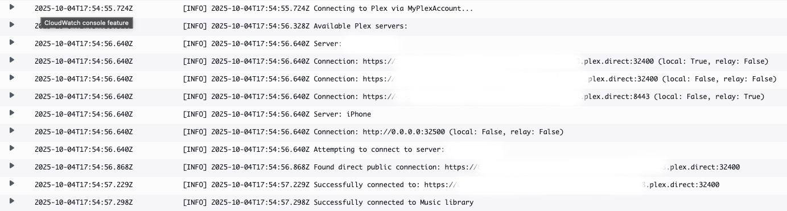
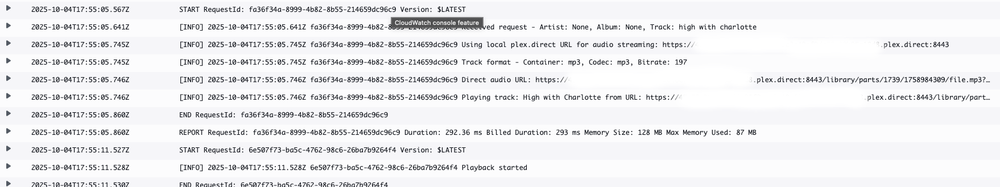
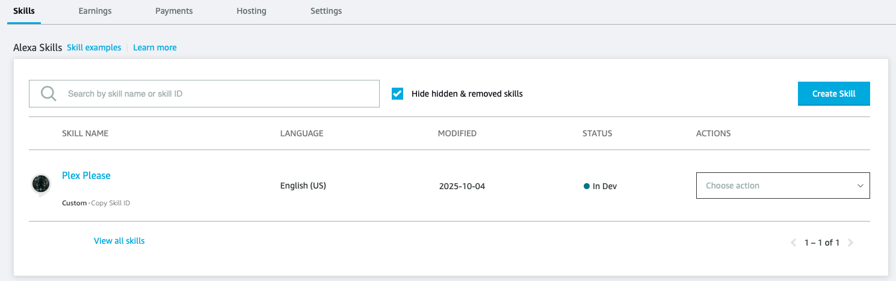
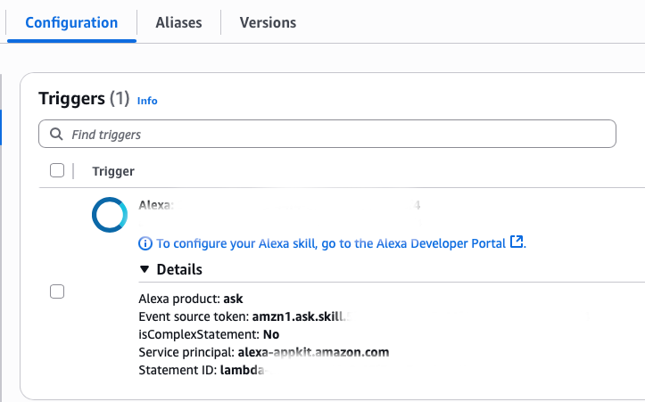
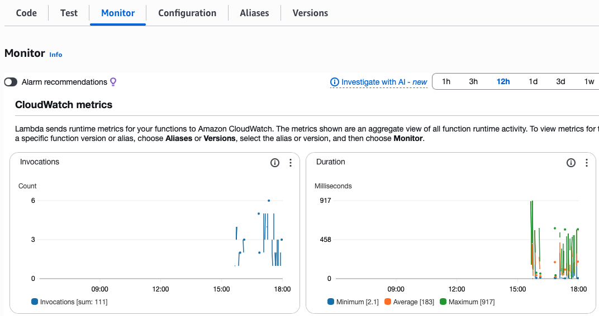
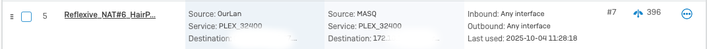

# alexa-plex-music-player-skill

This is an Alexa skill that allows playback of audio from their Plex Music library on Alexa/Echo devices. I was tired of the official Alexa -> Plex integration failing to play what I wanted to hear. It's buggy and that's being nice.

## Features

- **Full Plex Integration**: tracks, albums, artists, playlists
- **Continuous Playback**:
- **Next/Previous Controls**:
- **Shuffle Supported**:
- **Persistent Queue**: uses DynamoDB for persistent queue
- **Automatic Relay Detection**: works for local playback and remote!
- **Works Across Alexa Devices**: tested on Alexa and Echo devices
- **Handles Large Playlists**: no lambda/queue timeouts!

## Usage

### Create your AWS Lambda

1. Create a new AWS Lambda using the latest Python runtime
2. Copy and paste your PLEX TOKEN and your PLEX SERVER NAME into the lambda_function.py code
3. Prepare dependencies
  1. cd lambda/
  2. pip install -r requirements.txt -t ./
4. Zip the newly minted lambda
  1. zip -r ../archive.zip ./*
5. Upload archive.zip to the AWS Lambda Console
6. Deploy your new code!

Examples of successful invocations:

### Create your Alexa Skill

1. Create your new Alexa skill. I named mine "Plex Please" but you can call it anything you want. Note: This
is not linked to your invocation phrase so don't worry about picking something unique!
2. Set your invocation phrase
3. Set your endpoint - AWS Lambda ARN
4. Copy the Skill ID for use in the AWS Lambda Trigger phase
5. Set up the intent model JSON by pasting the json into the AWS Alexa Developer Console

### Set up the AWS Lambda Trigger

1. Add an AWS Lambda Trigger, type: Alexa Skill
2. Paste the skill id in the box

### Monitor Invocations

### For Local Use!

**NOTE:** You will need to create or enable hairpin nat on your firewall or gateway. Shown below is my home firewall,
a Sophos XG unit, with the correct setting for enablement. On some devices, it may be labeled as "DNS Rebind."

## Contributing

Contributions are welcome! Please feel free to submit a Pull Request.

1. Fork the repository
2. Create your feature branch (`git checkout -b feature/amazing-feature`)
3. Commit your changes (`git commit -m 'Add some amazing feature'`)
4. Push to the branch (`git push origin feature/amazing-feature`)
5. Open a Pull Request

Please make sure to update tests as appropriate and follow the code style guide.

## Acknowledgements

- Too many to list!

## License & Author

- Author:: Erin L. Kolp (<erinlkolpfoss@gmail.com>)

Copyright (c) 2025 Erin L. Kolp 

Licensed under the MIT License

Permission is hereby granted, free of charge, to any person obtaining a copy of this software and associated documentation files (the 'Software'), to deal in the Software without restriction, including without limitation the rights to use, copy, modify, merge, publish, distribute, sublicense, and/or sell copies of the Software, and to
permit persons to whom the Software is furnished to do so, subject to the following conditions:

The above copyright notice and this permission notice shall be included in all copies or substantial portions of the Software.

THE SOFTWARE IS PROVIDED 'AS IS', WITHOUT WARRANTY OF ANY KIND, EXPRESS OR IMPLIED, INCLUDING BUT NOT LIMITED TO THE WARRANTIES OF MERCHANTABILITY, FITNESS FOR A PARTICULAR PURPOSE AND NONINFRINGEMENT.  IN NO EVENT SHALL THE AUTHORS OR COPYRIGHT HOLDERS BE LIABLE FOR ANY CLAIM, DAMAGES OR OTHER LIABILITY, WHETHER IN AN ACTION OF CONTRACT, TORT OR OTHERWISE, ARISING FROM, OUT OF OR IN CONNECTION WITH THE SOFTWARE OR THE USE OR OTHER DEALINGS IN THE SOFTWARE.
